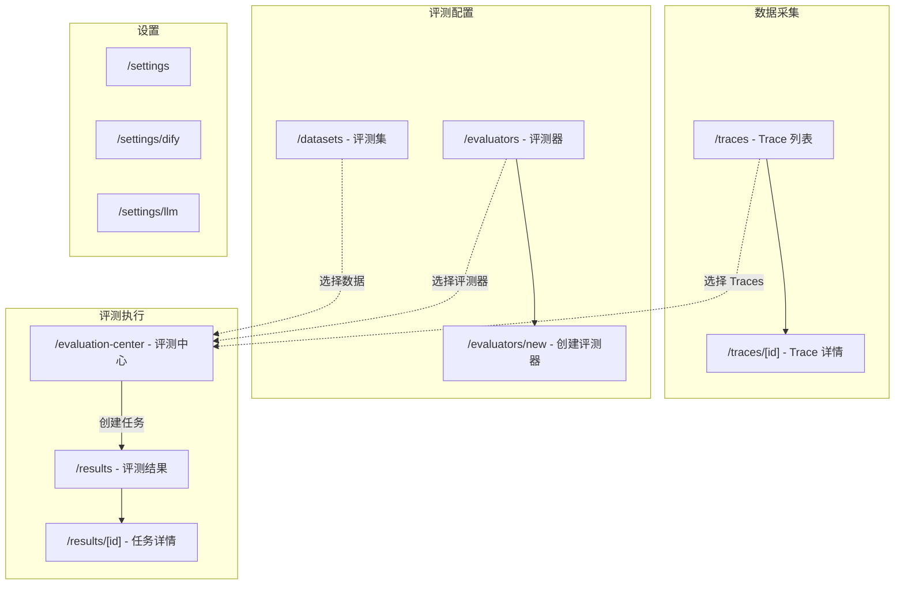

# SimpleFuse 功能补全实施计划

> **For Claude:** REQUIRED SUB-SKILL: Use superpowers:executing-plans to implement this plan task-by-task.

**Goal:** 基于 Langfuse 知识库分析，补全 SimpleFuse 的核心缺失功能

**Architecture:** 分三个优先级迭代实施：P0（核心功能）→ P1（功能增强）→ P2（锦上添花）。每个任务遵循 TDD 流程，完成后提交。

**Tech Stack:** Next.js 16, Prisma 7, PostgreSQL, tRPC, TypeScript, Vitest

---

## 现有前端页面结构

```
src/app/
├── page.tsx                        # 首页（重定向到 dashboard）
├── dashboard/page.tsx              # 仪表盘 - 统计卡片、图表
├── traces/
│   ├── page.tsx                    # Trace 列表
│   └── [traceId]/page.tsx          # Trace 详情 ✅ 已优化（时间线）
├── evaluators/
│   ├── page.tsx                    # 评测器列表（预置/自定义）
│   └── new/page.tsx                # 创建评测器
├── evaluation-center/page.tsx      # 评测中心 - 选择数据源+评测器+提交任务
├── datasets/
│   └── page.tsx                    # 评测集列表
├── results/
│   ├── page.tsx                    # 评测任务列表
│   └── [jobId]/page.tsx            # 任务结果详情
└── settings/
    ├── page.tsx                    # 设置首页
    ├── dify/page.tsx               # Dify 连接配置
    └── llm/page.tsx                # LLM 模型配置
```

### 页面导航关系



---

## Phase 1: P0 - 核心功能补全

### Task 1: Dataset Run 数据模型

**目标:** 创建 Dataset Run 体系，支持多次评估运行的追踪

**关联页面:** `/datasets` → 新增 `/datasets/[id]/runs`

**Files:**

- Modify: `prisma/schema.prisma`
- Create: `prisma/migrations/20260127_add_dataset_run/migration.sql`

**Step 1: 更新 Prisma Schema**

```prisma
model DatasetRun {
  id          String   @id @default(uuid())
  datasetId   String
  projectId   String
  name        String?
  description String?  @db.Text
  metadata    Json?
  createdAt   DateTime @default(now())

  dataset     Dataset  @relation(fields: [datasetId], references: [id], onDelete: Cascade)
  project     Project  @relation(fields: [projectId], references: [id], onDelete: Cascade)
  items       DatasetRunItem[]

  @@index([datasetId])
  @@index([projectId, createdAt])
}

model DatasetRunItem {
  id              String   @id @default(uuid())
  datasetRunId    String
  datasetItemId   String
  traceId         String?
  observationId   String?
  input           Json?
  expectedOutput  Json?
  output          Json?
  error           String?  @db.Text
  latencyMs       Int?
  totalTokens     Int?
  totalCost       Decimal? @db.Decimal(10, 6)
  createdAt       DateTime @default(now())

  datasetRun      DatasetRun  @relation(fields: [datasetRunId], references: [id], onDelete: Cascade)
  datasetItem     DatasetItem @relation(fields: [datasetItemId], references: [id], onDelete: Cascade)

  @@index([datasetRunId])
  @@index([datasetItemId])
}
```

**Step 2: 更新关联模型**

```prisma
model Dataset {
  // ... existing fields
  runs DatasetRun[]
}

model DatasetItem {
  // ... existing fields
  runItems DatasetRunItem[]
}

model Project {
  // ... existing fields
  datasetRuns DatasetRun[]
}
```

**Step 3: 生成迁移**

```bash
npx prisma migrate dev --name add_dataset_run
```

**Step 4: Commit**

```bash
git add prisma/
git commit -m "feat(schema): add DatasetRun and DatasetRunItem models"
```

---

### Task 2: Dataset Run tRPC Router

**目标:** 创建 Dataset Run 的 CRUD API

**Files:**

- Create: `src/server/routers/datasetRuns.ts`
- Modify: `src/server/root.ts` (注册 router)
- Create: `src/__tests__/datasetRuns-trpc.test.ts`

**Step 1: 创建 Router**

```typescript
// src/server/routers/datasetRuns.ts
import { z } from "zod";
import { router, publicProcedure } from "../trpc";
import prisma from "@/lib/prisma";

export const datasetRunsRouter = router({
  // 创建运行
  create: publicProcedure
    .input(
      z.object({
        datasetId: z.string(),
        projectId: z.string(),
        name: z.string().optional(),
        description: z.string().optional(),
      }),
    )
    .mutation(async ({ input }) => {
      return prisma.datasetRun.create({ data: input });
    }),

  // 列表查询
  list: publicProcedure
    .input(
      z.object({
        datasetId: z.string(),
        limit: z.number().default(20),
      }),
    )
    .query(async ({ input }) => {
      return prisma.datasetRun.findMany({
        where: { datasetId: input.datasetId },
        orderBy: { createdAt: "desc" },
        take: input.limit,
        include: { _count: { select: { items: true } } },
      });
    }),

  // 详情查询（含所有运行项）
  getById: publicProcedure
    .input(z.object({ id: z.string() }))
    .query(async ({ input }) => {
      return prisma.datasetRun.findUnique({
        where: { id: input.id },
        include: {
          items: {
            include: { datasetItem: true },
            orderBy: { createdAt: "asc" },
          },
        },
      });
    }),

  // 添加运行项
  addItems: publicProcedure
    .input(
      z.object({
        datasetRunId: z.string(),
        items: z.array(
          z.object({
            datasetItemId: z.string(),
            input: z.any().optional(),
            expectedOutput: z.any().optional(),
            output: z.any().optional(),
            error: z.string().optional(),
            latencyMs: z.number().optional(),
            totalTokens: z.number().optional(),
          }),
        ),
      }),
    )
    .mutation(async ({ input }) => {
      return prisma.datasetRunItem.createMany({
        data: input.items.map((item) => ({
          ...item,
          datasetRunId: input.datasetRunId,
        })),
      });
    }),

  // 删除
  delete: publicProcedure
    .input(z.object({ id: z.string() }))
    .mutation(async ({ input }) => {
      return prisma.datasetRun.delete({ where: { id: input.id } });
    }),
});
```

**Step 2: 注册 Router**

```typescript
// src/server/root.ts (添加)
import { datasetRunsRouter } from "./routers/datasetRuns";

export const appRouter = router({
  // ... existing routers
  datasetRuns: datasetRunsRouter,
});
```

**Step 3: Commit**

```bash
git add src/server/
git commit -m "feat(api): add datasetRuns tRPC router"
```

---

### Task 3: 更新 Datasets 页面 - 添加运行入口

**目标:** 在评测集卡片中添加"运行记录"入口

**关联页面:** `/datasets`

**Files:**

- Modify: `src/app/datasets/page.tsx`

**Step 1: 更新 DatasetCard 组件**

在现有 `DatasetCard` 中添加"运行记录"按钮：

```typescript
// 在 DatasetCard 中添加
<Button variant="ghost" size="sm" asChild>
  <Link href={`/datasets/${dataset.id}/runs`}>
    <History className="h-4 w-4 mr-1" />
    运行记录
  </Link>
</Button>
```

**Step 2: 添加 History 图标导入**

```typescript
import { History } from "lucide-react";
```

**Step 3: Commit**

```bash
git add src/app/datasets/page.tsx
git commit -m "feat(ui): add run history entry in datasets page"
```

---

### Task 4: Dataset Runs 列表页面

**目标:** 创建运行记录列表页

**路由:** `/datasets/[datasetId]/runs`

**Files:**

- Create: `src/app/datasets/[datasetId]/runs/page.tsx`

**Step 1: 创建页面**

```typescript
// src/app/datasets/[datasetId]/runs/page.tsx
'use client'

import { use } from 'react'
import { trpc } from '@/lib/trpc-client'
import { Card, CardContent, CardHeader, CardTitle } from '@/components/ui/card'
import { Button } from '@/components/ui/button'
import { Breadcrumb } from '@/components/ui/breadcrumb'
import { Badge } from '@/components/ui/badge'
import {
  History,
  ChevronRight,
  Calendar,
  Loader2,
  Plus,
} from 'lucide-react'
import Link from 'next/link'

interface PageProps {
  params: Promise<{ datasetId: string }>
}

export default function DatasetRunsPage({ params }: PageProps) {
  const { datasetId } = use(params)

  const { data: dataset } = trpc.datasets.getById.useQuery({ id: datasetId })
  const { data: runs, isLoading } = trpc.datasetRuns.list.useQuery({ datasetId })

  if (isLoading) {
    return (
      <div className="flex items-center justify-center h-64">
        <Loader2 className="h-8 w-8 animate-spin text-muted-foreground" />
      </div>
    )
  }

  return (
    <div className="space-y-6">
      <Breadcrumb
        items={[
          { label: '评测集', href: '/datasets' },
          { label: dataset?.name || '评测集' },
          { label: '运行记录' }
        ]}
        backHref="/datasets"
      />

      <div className="flex items-center justify-between">
        <div>
          <h1 className="text-2xl font-bold flex items-center gap-2">
            <History className="h-6 w-6" />
            运行记录
          </h1>
          <p className="text-muted-foreground">
            {dataset?.name} 的历史运行记录
          </p>
        </div>
      </div>

      {runs && runs.length > 0 ? (
        <div className="grid gap-4">
          {runs.map((run) => (
            <Link key={run.id} href={`/datasets/${datasetId}/runs/${run.id}`}>
              <Card className="glass cursor-pointer hover:border-primary/50 transition-colors">
                <CardHeader className="pb-2">
                  <div className="flex items-center justify-between">
                    <CardTitle className="text-lg">
                      {run.name || `运行 #${run.id.slice(0, 8)}`}
                    </CardTitle>
                    <ChevronRight className="h-5 w-5 text-muted-foreground" />
                  </div>
                </CardHeader>
                <CardContent>
                  <div className="flex items-center gap-4 text-sm text-muted-foreground">
                    <span className="flex items-center gap-1">
                      <Calendar className="h-4 w-4" />
                      {new Date(run.createdAt).toLocaleString('zh-CN')}
                    </span>
                    <Badge variant="secondary">
                      {run._count?.items || 0} 项
                    </Badge>
                  </div>
                </CardContent>
              </Card>
            </Link>
          ))}
        </div>
      ) : (
        <Card className="glass">
          <CardContent className="flex flex-col items-center justify-center py-12">
            <History className="h-12 w-12 text-muted-foreground mb-4" />
            <h3 className="text-lg font-medium mb-2">暂无运行记录</h3>
            <p className="text-muted-foreground text-center">
              使用此评测集运行评测后，记录将显示在这里
            </p>
          </CardContent>
        </Card>
      )}
    </div>
  )
}
```

**Step 2: Commit**

```bash
git add src/app/datasets/
git commit -m "feat(ui): add dataset runs list page"
```

---

### Task 5: Dataset Run 详情页面

**目标:** 创建运行详情页，展示期望输出 vs 实际输出对比

**路由:** `/datasets/[datasetId]/runs/[runId]`

**Files:**

- Create: `src/app/datasets/[datasetId]/runs/[runId]/page.tsx`

**Step 1: 创建页面**

```typescript
// src/app/datasets/[datasetId]/runs/[runId]/page.tsx
'use client'

import { use } from 'react'
import { trpc } from '@/lib/trpc-client'
import { Card, CardContent, CardHeader, CardTitle } from '@/components/ui/card'
import { Badge } from '@/components/ui/badge'
import { Breadcrumb } from '@/components/ui/breadcrumb'
import {
  CheckCircle2,
  XCircle,
  Loader2,
  ArrowRight,
} from 'lucide-react'

interface PageProps {
  params: Promise<{ datasetId: string; runId: string }>
}

export default function DatasetRunDetailPage({ params }: PageProps) {
  const { datasetId, runId } = use(params)

  const { data: run, isLoading } = trpc.datasetRuns.getById.useQuery({ id: runId })

  if (isLoading) {
    return (
      <div className="flex items-center justify-center h-64">
        <Loader2 className="h-8 w-8 animate-spin text-muted-foreground" />
      </div>
    )
  }

  if (!run) {
    return <div>运行记录不存在</div>
  }

  return (
    <div className="space-y-6">
      <Breadcrumb
        items={[
          { label: '评测集', href: '/datasets' },
          { label: '运行记录', href: `/datasets/${datasetId}/runs` },
          { label: run.name || `运行 #${run.id.slice(0, 8)}` }
        ]}
        backHref={`/datasets/${datasetId}/runs`}
      />

      <div>
        <h1 className="text-2xl font-bold">
          {run.name || `运行 #${run.id.slice(0, 8)}`}
        </h1>
        <p className="text-muted-foreground">
          {new Date(run.createdAt).toLocaleString('zh-CN')}
        </p>
      </div>

      {/* 运行项列表 */}
      <div className="space-y-4">
        {run.items.map((item, index) => (
          <Card key={item.id} className="glass">
            <CardHeader className="pb-2">
              <div className="flex items-center justify-between">
                <CardTitle className="text-base">
                  #{index + 1} {item.datasetItem?.input ? '...' : '未知输入'}
                </CardTitle>
                {item.error ? (
                  <Badge variant="destructive" className="gap-1">
                    <XCircle className="h-3 w-3" />
                    失败
                  </Badge>
                ) : (
                  <Badge variant="default" className="gap-1">
                    <CheckCircle2 className="h-3 w-3" />
                    成功
                  </Badge>
                )}
              </div>
            </CardHeader>
            <CardContent>
              <div className="grid grid-cols-2 gap-4">
                <div>
                  <h4 className="text-sm font-medium text-muted-foreground mb-2">期望输出</h4>
                  <pre className="bg-muted/50 rounded p-3 text-sm overflow-auto max-h-32">
                    {item.expectedOutput ? JSON.stringify(item.expectedOutput, null, 2) : '-'}
                  </pre>
                </div>
                <div>
                  <h4 className="text-sm font-medium text-muted-foreground mb-2">实际输出</h4>
                  <pre className="bg-muted/50 rounded p-3 text-sm overflow-auto max-h-32">
                    {item.output ? JSON.stringify(item.output, null, 2) : '-'}
                  </pre>
                </div>
              </div>

              {item.error && (
                <div className="mt-4 p-3 bg-red-50 dark:bg-red-900/20 rounded text-sm text-red-600 dark:text-red-400">
                  {item.error}
                </div>
              )}

              <div className="flex gap-4 mt-4 text-sm text-muted-foreground">
                {item.latencyMs && <span>延迟: {item.latencyMs}ms</span>}
                {item.totalTokens && <span>Tokens: {item.totalTokens}</span>}
              </div>
            </CardContent>
          </Card>
        ))}
      </div>
    </div>
  )
}
```

**Step 2: Commit**

```bash
git add src/app/datasets/
git commit -m "feat(ui): add dataset run detail page with expected vs actual comparison"
```

---

### Task 6: 公开 REST API - Traces

**目标:** 创建 Langfuse 兼容的公开 Traces REST API

**关联:** 外部集成需要

**Files:**

- Create: `src/app/api/public/traces/route.ts`
- Create: `src/app/api/public/traces/[traceId]/route.ts`

**Step 1: 创建列表 API**

```typescript
// src/app/api/public/traces/route.ts
import { NextRequest, NextResponse } from "next/server";
import prisma from "@/lib/prisma";

// 验证 Auth
async function validateAuth(request: Request): Promise<string | null> {
  const authHeader = request.headers.get("Authorization");
  if (!authHeader?.startsWith("Basic ")) return null;

  try {
    const credentials = Buffer.from(
      authHeader.split(" ")[1],
      "base64",
    ).toString("ascii");
    const [publicKey] = credentials.split(":");

    // 简化：返回默认项目
    const project = await prisma.project.findFirst();
    return project?.id || null;
  } catch {
    return null;
  }
}

export async function GET(request: NextRequest) {
  const projectId = await validateAuth(request);
  if (!projectId) {
    return NextResponse.json({ error: "Unauthorized" }, { status: 401 });
  }

  const { searchParams } = new URL(request.url);
  const limit = parseInt(searchParams.get("limit") || "20");
  const page = parseInt(searchParams.get("page") || "1");

  const traces = await prisma.trace.findMany({
    where: { projectId },
    orderBy: { timestamp: "desc" },
    take: limit,
    skip: (page - 1) * limit,
  });

  return NextResponse.json({ data: traces });
}
```

**Step 2: 创建详情 API**

```typescript
// src/app/api/public/traces/[traceId]/route.ts
import { NextRequest, NextResponse } from "next/server";
import prisma from "@/lib/prisma";

export async function GET(
  request: NextRequest,
  { params }: { params: Promise<{ traceId: string }> },
) {
  const { traceId } = await params;

  const trace = await prisma.trace.findUnique({
    where: { id: traceId },
  });

  if (!trace) {
    return NextResponse.json({ error: "Not found" }, { status: 404 });
  }

  return NextResponse.json({ data: trace });
}

export async function DELETE(
  request: NextRequest,
  { params }: { params: Promise<{ traceId: string }> },
) {
  const { traceId } = await params;

  await prisma.trace.delete({
    where: { id: traceId },
  });

  return NextResponse.json({ success: true });
}
```

**Step 3: Commit**

```bash
git add src/app/api/public/traces/
git commit -m "feat(api): add public REST API for traces"
```

---

### Task 7: 公开 REST API - Scores

**目标:** 创建 Langfuse 兼容的 Scores REST API

**Files:**

- Create: `src/app/api/public/scores/route.ts`

类似 Task 6 实现...

---

## Phase 2: P1 - 功能增强

### Task 8: Score 模型增强

**目标:** 增强 Score 支持 Observation 关联和多类型评分

**Files:**

- Modify: `prisma/schema.prisma`

**变更:**

```prisma
model Score {
  id            String   @id
  traceId       String
  observationId String?  // 新增：关联到具体 Observation
  projectId     String
  evaluatorId   String
  evaluatorName String
  score         Float
  dataType      String   @default("NUMERIC") // 新增: NUMERIC | CATEGORICAL | BOOLEAN
  stringValue   String?  // 新增：分类型评分的字符串值
  reasoning     String?  @db.Text
  source        String   @default("EVAL") // 新增: API | EVAL | ANNOTATION
  authorUserId  String?  // 新增：人工标注的用户
  evalJobId     String?
  timestamp     DateTime
  createdAt     DateTime @default(now())

  // relations...
}
```

---

### Task 9: 游标分页

**目标:** 将 Traces 列表 offset 分页改为游标分页

**Files:**

- Modify: `src/lib/clickhouse/queries.ts`
- Modify: `src/server/routers/traces.ts`
- Modify: `src/app/traces/page.tsx`

---

## 验证清单

### 页面导航验证

| 路径                          | 功能                 | 状态      |
| ----------------------------- | -------------------- | --------- |
| `/dashboard`                  | 仪表盘               | ✅ 已有   |
| `/traces`                     | Trace 列表           | ✅ 已有   |
| `/traces/[id]`                | Trace 详情（时间线） | ✅ 已优化 |
| `/evaluators`                 | 评测器列表           | ✅ 已有   |
| `/evaluators/new`             | 创建评测器           | ✅ 已有   |
| `/datasets`                   | 评测集列表           | ✅ 已有   |
| `/datasets/[id]/runs`         | **运行记录列表**     | ✅ 已实现 |
| `/datasets/[id]/runs/[runId]` | **运行详情**         | ✅ 已实现 |
| `/evaluation-center`          | 评测中心             | ✅ 已有   |
| `/results`                    | 评测结果列表         | ✅ 已有   |
| `/results/[id]`               | 任务结果详情         | ✅ 已有   |
| `/settings/dify`              | Dify 配置            | ✅ 已有   |
| `/settings/llm`               | LLM 配置             | ✅ 已有   |

### API 验证

| 端点                      | 方法       | 状态      |
| ------------------------- | ---------- | --------- |
| `/api/public/ingestion`   | POST       | ✅ 已有   |
| `/api/public/traces`      | GET        | ✅ 已实现 |
| `/api/public/traces/[id]` | GET/DELETE | ✅ 已实现 |
| `/api/public/scores`      | POST/GET   | ✅ 已实现 |

---

## Phase 1 执行日志 (2026-01-27)

### 执行概要

- **开始时间**: 14:30
- **完成时间**: 14:45
- **状态**: ✅ 全部完成

### 变更文件清单

**数据模型**:

- `prisma/schema.prisma` - 添加 DatasetRun, DatasetRunItem 模型
- `prisma/migrations/20260127063550_add_dataset_run/` - 数据库迁移

**后端 API**:

- `src/server/routers/datasetRuns.ts` - [NEW] tRPC router
- `src/server/root.ts` - 注册 datasetRuns router
- `src/app/api/public/traces/route.ts` - [NEW] Traces 列表 API
- `src/app/api/public/traces/[traceId]/route.ts` - [NEW] Trace 详情/删除 API
- `src/app/api/public/scores/route.ts` - [NEW] Scores 列表/创建 API

**前端页面**:

- `src/app/datasets/page.tsx` - 添加运行记录入口按钮
- `src/app/datasets/[datasetId]/runs/page.tsx` - [NEW] 运行记录列表页
- `src/app/datasets/[datasetId]/runs/[runId]/page.tsx` - [NEW] 运行详情页

---

## Phase 2 执行日志 (2026-01-27)

### 执行概要

- **开始时间**: 14:55
- **完成时间**: 15:10
- **状态**: ✅ 全部完成

### 变更文件清单

**数据模型**:

- `prisma/schema.prisma` - Score 模型增强（添加 observationId, dataType, stringValue, source, authorUserId）
- `prisma/migrations/20260127065545_enhance_score_model/` - 数据库迁移

**游标分页**:

- `src/lib/clickhouse/queries.ts` - 添加 cursor 参数和 nextCursor 返回
- `src/server/routers/traces.ts` - 支持游标分页参数

---

## 验证结果

- ✅ Prisma 迁移成功（全部 4 个迁移）
- ✅ Prisma Client 生成成功
- ✅ TypeScript 编译成功
- ✅ Next.js 生产构建成功

---

**全部任务完成 ✅** Phase 1 + Phase 2 实施完毕。
。
